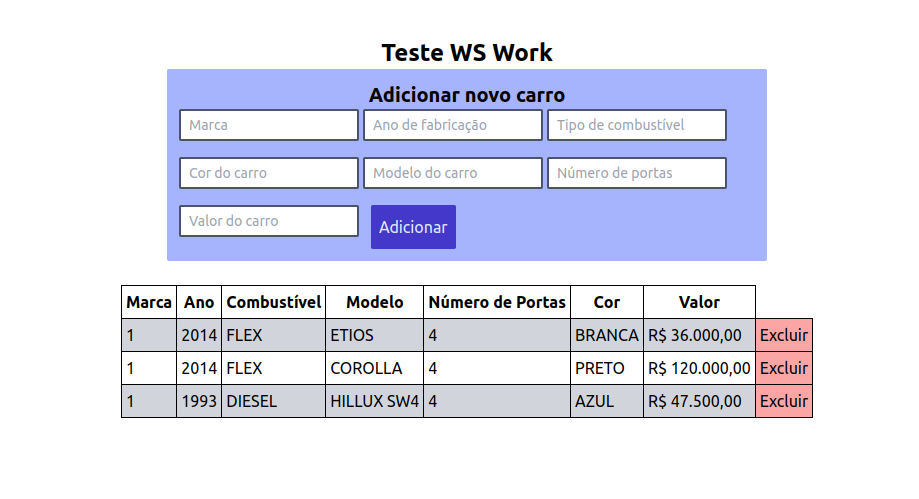

# Teste Front End WS Work

Neste teste utilizei a ferramenta Vite para facilitar a criação da aplicação e pela rapidez, Axios para realizar as requisições e Tailwind para estilização.
Optei por usar JSON Server para criar uma API fake por conta de problemas com CORS que enfrentei no momento de requisição da api pelos seguintes links:

- [cars.json](https://wswork.com.br/cars.json)
- [cars_by_brand.json](https://wswork.com.br/cars_by_brand.json)

<p align="center">

</p>

## O que é possível fazer?

- Visualizar lista de carros
- Adicionar carros a lista
- Deletar carros da lista

## Estrutura do Teste

- `./src/components`: São todos os pedaços primordiais de interface como componentes de formulário, `<List>`, `<LineTable>` e o `<Table>`
  - `<Form>`: Renderiza o formulário para adicionar carros na listagem, com inputs para a marca, ano de fabricação, tipo de combustível, cor, modelo, número de portas e valor do carro. Coloquei um padrão regex em cada um dos inputs para evitar erros de inserção de dados, cada input tem um estado que é usado no submissão do formulário. No momento de submeter, são criados, de forma aleatória, as propriedades id e modelo_id no corpo da requisição;
  - `<List>`: Renderiza uma tabela com informações sobre: Marca, ano de fabricação, combustível, modelo, número de portas, cor e valor do carro. Cada linha de informação é renderizada no `<LineTable>`;
    - `<LineTable>`: Apresenta os dados recebidos pela API de acordo com a respectiva coluna da tabela, em cada linha há uma opção para deletar o carro da tabela;
- `/.src/hooks`: São hooks personalizados que podem ser implementados em outras partes do projeto.
  - `<useFetch>`: Um hook que retorna um objeto com os dados, status de carregamento dos dados e erro (caso exista), a partir de uma url fornecida como parâmetro do hook;

### Tecnologias

- Vite
- React
- TailwindCSS
- Axios

### Requerimentos

- NodeJS (v22.3.0)
- NPM (10.8.1)
- JSON Server (1.0.0-beta.1)

```
/* Clonar repositório */
git clone https://github.com/thawansilva/testewswork.git

/* Acessar a pasta */
cd testewswork

/* Instalar os pacotes necessários */
npm install

/* Rodar a aplicação */
npm run dev

/* Simular uma API RESTful (Executar em outro terminal) */
npm run server

```
